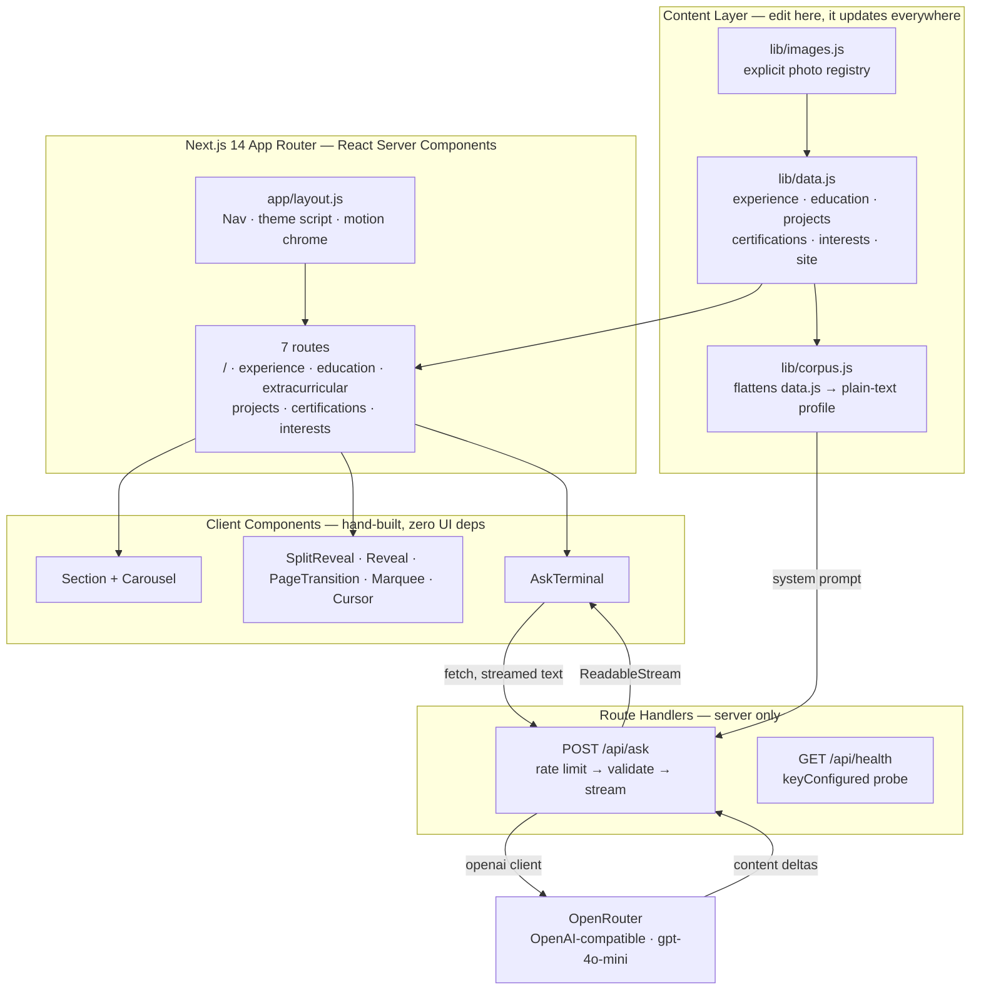

<div align="center">

# ◐ Nidhi Poojari — Portfolio

**A black-and-white editorial portfolio with an LLM that can answer questions about my work.**

*Hand-built in Next.js 14 — no UI kit, no animation library, no CSS framework. Every line of CSS in here is mine.*

[](https://nidhipoojari.vercel.app)
[](https://nextjs.org/)
[](https://react.dev/)
[](https://nextjs.org/docs/app/building-your-application/styling/css-modules)
[](#-api-reference)
[](#-deployment)

</div>

---

## 📖 Why this exists

I got tired of the same portfolio template everyone has — a hero, three cards, a contact form, done.

So I built this one from an empty folder. It's part portfolio and part professional diary: it tracks the move from BSE systems engineering into full-stack and AI work, and I deliberately left some personality in it rather than sanding it down into another recruiter-safe grid.

Two constraints shaped every decision:

| Constraint | What it meant in practice |
|---|---|
| **Ship it on a stack I've actually used in production** | No React Three Fiber, no experimental flags. Next.js App Router and plain React — the same things I write at work. |
| **No dependency I could write myself in an afternoon** | The carousel, the scroll reveals, the word-by-word heading reveal, the marquee, the cursor and the page transitions are all hand-rolled. `package.json` has **four** runtime dependencies, and one of them is React. |

The result is a site that loads fast, degrades cleanly with JavaScript off, respects `prefers-reduced-motion`, and gave me a place to put a small piece of AI engineering that isn't a chatbot demo.

---

## ✨ What's in it

| Feature | Description |
|---|---|
| 💬 **Ask terminal** | A monospace command line where a visitor can ask *"does she have production experience at scale?"* and get a streamed, grounded answer — **gpt-4o-mini via OpenRouter**, with the whole site as its context. |
| 🖼️ **Hand-built carousel** | Arrows, dots, keyboard nav, pointer-event swipe, two aspect-ratio variants. No Swiper, no Embla, ~180 lines. |
| 🎞️ **Motion primitives** | `SplitReveal` (word-by-word mask reveal), `Reveal` (IntersectionObserver fade-up), `PageTransition` (route-change fade). CSS animations, no Framer Motion. |
| 🌗 **Flash-free theming** | Light/dark stored in `localStorage` and applied by a blocking inline script *before* first paint, so there's no white flash on a dark-mode reload. |
| 🖱️ **Difference-blend cursor** | A dot that inverts whatever it passes over via `mix-blend-mode: difference`. Only mounts for fine pointers, never for reduced-motion visitors. |
| 📝 **One content file** | Every word on the site lives in `lib/data.js`. Adding a job is an object literal, not a JSX edit. |
| ♿ **Works without JS** | The reveal-hidden state is gated behind an `html.js` class, so a no-JS visitor gets a plain readable page — not a blank one. |

---

## 🛠️ Skills & Technologies

<table>
<tr><td valign="top" width="50%">

**Frontend Engineering**
- **Next.js 14 App Router** — server components by default, `'use client'` only where state or DOM access demands it
- **React 18** — hooks, refs, `useCallback`, cleanup-correct effects
- **CSS Modules** + a global design-token layer (no Tailwind, no CSS-in-JS)
- Fluid type & spacing with `clamp()`, CSS Grid, container-less responsive layout
- `next/font` self-hosting for zero-layout-shift webfonts

</td><td valign="top" width="50%">

**Animation & Interaction (all hand-written)**
- Mask-reveal display type with per-word `animationDelay` stagger
- `IntersectionObserver` scroll reveals with above-the-fold handling
- Pointer-event swipe/drag with axis-intent detection
- `requestAnimationFrame` lerp for the trailing cursor
- Seamless CSS marquee (duplicated track, `-50%` translate)
- Shared easing curves as custom properties

</td></tr>
<tr><td valign="top">

**AI / LLM Engineering**
- **OpenRouter** through its OpenAI-compatible API — one base-URL change swaps the whole provider
- Streaming chat completions piped token-by-token into the UI
- Corpus building — `lib/data.js` flattened into a plain-text profile at import time
- Stable-prefix prompt ordering so automatic prompt caching can hit
- `content_filter` and empty-completion handling; graceful degradation with **no API key at all**
- `/api/health` key-presence probe that never echoes the key

</td><td valign="top">

**Backend & API**
- Next.js **Route Handlers** (`runtime = 'nodejs'`, `force-dynamic`)
- `ReadableStream` + `TextEncoder` response streaming
- In-memory fixed-window **rate limiting** keyed by IP, with bounded-map cleanup
- Input validation, length caps, server-only secret handling
- Client-side `AbortController` cancellation on unmount

</td></tr>
<tr><td valign="top">

**Accessibility & UX**
- `prefers-reduced-motion` respected across every animation
- `aria-live` streaming answers, `role="tab"` carousel dots, labelled controls
- Screen-reader text layer under every decorative split-text animation
- Scroll lock + `Escape` handling on the mobile menu
- WCAG AA contrast verified in **both** themes

</td><td valign="top">

**Tooling & Delivery**
- **Vercel** — push-to-`main` CI/CD, preview deployments per branch
- Environment-based config with a committed `.env.local.example`
- `jsconfig.json` path aliases (`@/components`, `@/lib`)
- Node utility script for staging image assets
- Git-based content workflow — copy edits are one-file commits

</td></tr>
</table>

---

## 🏗️ Architecture



**The ask-terminal request path, end to end:**

```
visitor types a question
   → AbortController cancels any in-flight request
   → POST /api/ask
   → IP rate-limit gate  (12 requests / 10 min, per instance)
   → validate + 400-char cap
   → system prompt = full site corpus   [stable prefix, cacheable]
   → user message = the question        [the only volatile part]
   → OpenRouter → gpt-4o-mini, temperature 0.3, stream: true
   → content deltas → TextEncoder → ReadableStream
   → reader.read() loop → setAnswer(prev + chunk)
   → answer types itself out on screen, character by character
```

Every hop has a fallback: no API key → a "just email me" message; rate-limited → a friendly 429; network failure → my email address. **The page never shows a broken state.**

---

## 🎨 Design System

The whole site runs on one monochrome token set defined in `app/globals.css` — hierarchy comes from **value and scale, not hue**.

| Token group | Purpose |
|---|---|
| `--bg` · `--bg-soft` · `--line` | Page, surface, hairline — the three-layer depth model |
| `--fg-display` · `--fg` · `--fg-soft` · `--fg-muted` · `--fg-faint` | Five-step text ramp; display type sits one step brighter than body copy |
| `--font-display` · `--font-body` | Forum (serif), self-hosted through `next/font` |
| `--ease-smooth` · `--ease-pop` | Two shared curves — *smooth* for content settling, *pop* for controls |
| `--max-w` · `--gutter` | `clamp()`-driven fluid gutter, one max-width for the whole site |

Light mode redefines the same tokens in the same warm-neutral hue family, inverted in value — every text/background pair holds at least **4.5:1** contrast.

---

## 📁 Project Structure

```
.
├── app/
│   ├── layout.js              Root layout — Nav, theme boot script, motion chrome
│   ├── page.js                Home — hero, skills marquee, about, ask terminal
│   ├── globals.css            Design tokens, reset, shared page classes
│   ├── api/ask/route.js       Streaming LLM endpoint (server only)
│   ├── api/health/route.js    Is the API key wired up in this deploy?
│   ├── experience/            ┐
│   ├── education/             │
│   ├── extracurricular/       ├─ one folder = one URL, each rendering <Section/>
│   ├── projects/              │
│   ├── certifications/        │
│   └── interests/             ┘
├── components/
│   ├── AskTerminal.js         Streaming Q&A command line
│   ├── Carousel.js            Arrows · dots · keyboard · swipe, no library
│   ├── Section.js             Two-column copy + media block, reused by 5 pages
│   ├── SplitReveal.js         Word-by-word mask reveal for display type
│   ├── Reveal.js              IntersectionObserver fade-up
│   ├── PageTransition.js      Route-change fade, keyed on pathname
│   ├── Marquee.js             Seamless CSS skills strip
│   ├── Cursor.js              Difference-blend trailing dot
│   ├── Nav.js                 Desktop links + full-screen mobile panel
│   └── ThemeToggle.js         Light/dark, persisted to localStorage
├── lib/
│   ├── data.js                ★ Every word on the site lives here
│   ├── images.js              Explicit photo registry per section
│   └── corpus.js              data.js → plain-text profile for the LLM
├── public/images/             Served photos, one folder per section
├── scripts/copy-images.js     Stages new photos into public/images
└── .env.local.example         The one env var this project takes
```

---

## 🚀 Quick Start

**Prerequisites:** Node 18.17+ (Node 20 recommended). *The API key is optional — everything except the ask terminal runs without it.*

```bash
git clone https://github.com/nidhipoojari/Portfolio-Website.git
cd Portfolio-Website
npm install
npm run dev
```

Open **http://localhost:3000**.

**To enable the ask terminal locally:**

```bash
cp .env.local.example .env.local   # then paste your key
```

```dotenv
OPENAI_API_KEY=sk-or-v1-...

# Both optional — these are the defaults.
OPENAI_BASE_URL=https://openrouter.ai/api/v1
AI_MODEL=openai/gpt-4o-mini
```

Get a key at [openrouter.ai/keys](https://openrouter.ai/keys). Without it the box politely tells visitors to email me instead — nothing else on the site depends on it.

**Swapping providers** is a base-URL change, because OpenRouter speaks the OpenAI wire format and the route uses the official `openai` client. To go direct to OpenAI, set `OPENAI_BASE_URL=https://api.openai.com/v1` and `AI_MODEL=gpt-4o-mini` (no `openai/` prefix). No code edit.

Confirm a running instance actually picked the key up:

```bash
curl -s http://localhost:3000/api/health
# {"ok":true,"keyConfigured":true,"model":"openai/gpt-4o-mini", …}
```

### Scripts

| Command | What it does |
|---|---|
| `npm run dev` | Dev server with hot reload |
| `npm run build` | Production build |
| `npm start` | Serve the production build |
| `npm run lint` | `next lint` |
| `npm run copy-images` | Mirror `/images` → `/public/images` |

### Making it yours

| To change… | Edit… |
|---|---|
| Any text — experience, education, projects, about | `lib/data.js` |
| Which photos appear in which section | `lib/images.js` |
| Colors, spacing, type scale, motion curves | `app/globals.css` |
| Home page layout | `app/home.module.css` |
| What the AI knows about you | `lib/corpus.js` (it reads `data.js` — usually nothing to do) |

---

## 🌐 API Reference

Two endpoints — one does the work, one tells you whether it can.

### `POST /api/ask`

**Request**

```json
{ "question": "What AI work has she shipped?" }
```

**Response** — `text/plain; charset=utf-8`, streamed as it generates (not JSON, not SSE — just a text stream you can pipe straight into React state).

```
Nidhi has shipped NestIQ, a production AI platform for Airbnb price
intelligence with SHAP-explained predictions and a five-tool agent…
```

| Status | Meaning | Body |
|---|---|---|
| `200` | Streaming answer | Plain-text deltas |
| `400` | Missing, empty, unparseable, or >400-char question | Short explanation |
| `429` | Over 12 requests in 10 minutes from one IP | "Give it a few minutes, or just email…" |
| `503` | `OPENAI_API_KEY` not configured | Falls back to my email address |

**Implementation notes**

- `runtime = 'nodejs'`, `dynamic = 'force-dynamic'` — never statically cached
- The corpus is byte-stable and goes in the system message, so it stays a constant prefix across requests and automatic prompt caching has something to match on; the question is the only part that varies
- Rate limiting is in-memory per instance and resets on cold start — a courtesy throttle against casual abuse, *not* a security boundary. Vercel KV is the swap-in if this ever sees real traffic
- A refusal arrives as a successful stream carrying no content, so an empty completion is handled explicitly rather than left as silence
- The key is read server-side only and never reaches the browser bundle

**Try it from the terminal:**

```bash
curl -N -X POST http://localhost:3000/api/ask \
  -H 'Content-Type: application/json' \
  -d '{"question":"Has she worked with Kubernetes?"}'
```

### `GET /api/health`

Answers one question: did this deployment actually get an API key? The failure it catches is a silent one — miss the env var in Vercel and the site builds clean, looks perfect, and quietly tells every visitor to send an email instead.

```json
{
  "ok": true,
  "keyConfigured": true,
  "model": "openai/gpt-4o-mini",
  "baseUrl": "https://openrouter.ai/api/v1"
}
```

Reports only *whether* a key is present, never the key or any prefix of it.

---

## ☁️ Deployment

Hosted on **Vercel**, deployed on every push to `main`. No build config, no CI file — the App Router build is the whole pipeline.

```
git push origin main   →   Vercel build   →   live in ~40s
```

**To deploy your own copy:**

1. Import the repo at [vercel.com/new](https://vercel.com/new) — the Next.js preset is detected automatically
2. Add `OPENAI_API_KEY` under **Project → Settings → Environment Variables** (skip this and the site still deploys fine, just without the ask terminal). `OPENAI_BASE_URL` and `AI_MODEL` are optional overrides
3. Push to `main`
4. Hit `/api/health` on the deployed URL to confirm the key came through

Environment variables are read at request time, not baked into the build — but Vercel only re-reads them on a new deployment, so adding the key to an existing project needs a redeploy before `/api/health` will admit to seeing it.

Every non-`main` branch gets its own preview URL, which is how the copy on this site gets proofread before it goes public.

---

## 🗺️ Routes

| Route | Contents |
|---|---|
| `/` | Hero, skills marquee, about, ask terminal |
| `/experience` | Roles, with the stack used at each |
| `/education` | Degrees and institutions |
| `/extracurricular` | Leadership and volunteering |
| `/projects` | Selected work — live, GitHub and paper links |
| `/certifications` | CKA, LFCS, Jenkins, FastAPI, DevOps, Shell |
| `/interests` | Cooking, painting, tennis — the non-engineer half |

---

## 📌 Things I'd do differently

Keeping myself honest:

- **`` instead of `next/image`.** Deliberate for now — the photos are pre-sized and the optimizer added more config than it saved. It's the first thing I'd revisit if the image count grows.
- **The rate limiter is per-instance.** Serverless means several instances, so the real ceiling is higher than 12/10min. Fine at this traffic; wrong at any other.
- **No test suite.** For a content site with no branching logic I decided the build was the test. I wouldn't make that call on anything with state worth breaking.

---

<div align="center">

**Live:** [nidhipoojari.vercel.app](https://nidhipoojari.vercel.app) · **Email:** [nidhipoojari702@gmail.com](mailto:nidhipoojari702@gmail.com) · **LinkedIn:** [@nidhipoojarii](https://www.linkedin.com/in/nidhipoojarii/)

Designed, written and built by **Nidhi Poojari** — Baltimore, MD

</div>
