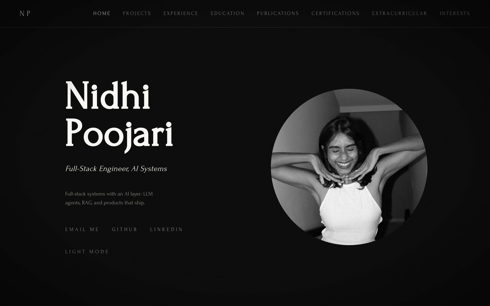
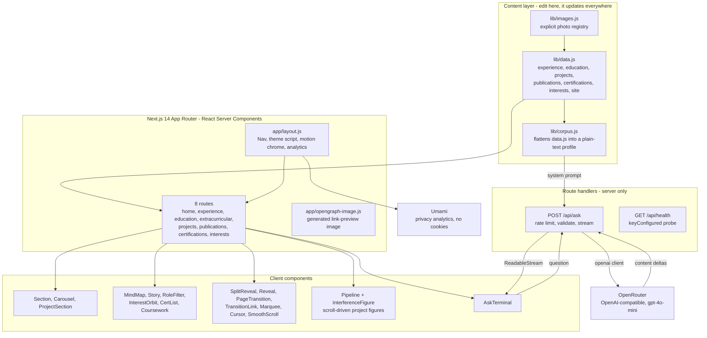

<div align="center">

# ◐ Nidhi Poojari · Portfolio

My personal site, with a small AI assistant that answers questions about my work.

**[nidhipoojari.com](https://nidhipoojari.com)**

[](https://nidhipoojari.com)
[](https://nextjs.org/docs/14/app)
[](https://react.dev/)
[](https://nextjs.org/docs/14/app/building-your-application/styling/css-modules)
[](#the-ask-box)
[](#tech-stack)
[](https://umami.is/docs)
[](#architecture)



</div>

---

## About

I built this from scratch rather than starting from a template. I wanted it to look like mine, and it gave me a place to practise what I like doing most: careful front-end work, a small backend, and an AI feature that behaves.

## Tech stack

| Category | What's used | Where |
|---|---|---|
| **Frontend** | [Next.js 14](https://nextjs.org/docs/14/app) App Router, [React 18](https://react.dev/), Server Components by default, `next/font` (Forum, self-hosted) | `app/`, `components/` |
| **Styling & design** | [CSS Modules](https://nextjs.org/docs/14/app/building-your-application/styling/css-modules), one monochrome token set, fluid `clamp()` type, light/dark themes at WCAG AA contrast | `app/globals.css`, `*.module.css` |
| **Motion & interaction** | Hand-written CSS/JS reveals, View Transitions API, CSS scroll-driven animation, Canvas 2D, [Lenis](https://github.com/darkroomengineering/lenis), [anime.js](https://animejs.com/), [Motion](https://motion.dev/) | `components/SplitReveal.js`, `InterestOrbit.js`, `InterferenceField.js` |
| **AI** | [OpenRouter](https://openrouter.ai/docs) → gpt-4o-mini via the [OpenAI SDK](https://github.com/openai/openai-node), token streaming, site-grounded prompt with validated links and follow-ups | `app/api/ask/route.js`, `lib/corpus.js`, `components/AskTerminal.js` |
| **Backend & API** | Next.js Route Handlers (Node runtime), `ReadableStream` responses, per-IP rate limiting, input validation, `next/og` link-preview image | `app/api/`, `app/opengraph-image.js` |
| **Data & content** | All site copy in one JS module, an explicit image registry, a plain-text corpus built from the same data | `lib/data.js`, `lib/images.js` |
| **Delivery & analytics** | [Vercel](https://vercel.com/docs) (push to `main` deploys), [Umami](https://umami.is/docs) privacy analytics, GitHub | `components/Analytics.js`, `lib/analytics.js` |

## Architecture


```mermaid
flowchart TD
    subgraph content["Content layer - edit here, it updates everywhere"]
        D["lib/data.js<br/>experience, education, projects,<br/>publications, certifications, interests, site"]
        I["lib/images.js<br/>explicit photo registry"]
        C["lib/corpus.js<br/>flattens data.js into a plain-text profile"]
    end
    subgraph app["Next.js 14 App Router - React Server Components"]
        L["app/layout.js<br/>Nav, theme script, motion chrome, analytics"]
        R["8 routes<br/>home, experience, education, extracurricular,<br/>projects, publications, certifications, interests"]
        OG["app/opengraph-image.js<br/>generated link-preview image"]
    end
    subgraph ui["Client components"]
        S["Section, Carousel, ProjectSection"]
        P["MindMap, Story, RoleFilter,<br/>InterestOrbit, CertList, Coursework"]
        M["SplitReveal, Reveal, PageTransition,<br/>TransitionLink, Marquee, Cursor, SmoothScroll"]
        F["Pipeline + InterferenceFigure<br/>scroll-driven project figures"]
        T["AskTerminal"]
    end
    subgraph api["Route handlers - server only"]
        RT["POST /api/ask<br/>rate limit, validate, stream"]
        H["GET /api/health<br/>keyConfigured probe"]
    end
    CL["OpenRouter<br/>OpenAI-compatible, gpt-4o-mini"]
    UM["Umami<br/>privacy analytics, no cookies"]

    I --> D
    D --> C
    D --> R
    L --> R
    R --> S
    R --> P
    R --> M
    R --> F
    R --> T
    L --> UM
    T -->|question| RT
    C -->|system prompt| RT
    RT -->|openai client| CL
    CL -->|content deltas| RT
    RT -->|ReadableStream| T
```

**The ask box request path, end to end:**

```
visitor types a question
   → AbortController cancels any in-flight request
   → POST /api/ask
   → IP rate-limit gate  (12 requests / 10 min, per instance)
   → validate + 400-char cap
   → system prompt = full site corpus   [stable prefix, cacheable]
   → user message = the question        [the only volatile part]
   → OpenRouter → gpt-4o-mini, temperature 0.3, stream: true
   → prose deltas → TextEncoder → ReadableStream
   → trailing metadata line cut off, validated, sent as one last frame
     (links to the jobs/projects used + three follow-up questions)
   → reader.read() loop → answer types itself out on screen
```

Every hop has a fallback: no API key → a "just email me" message; rate-limited → a friendly 429; network failure → my email address. The page never shows a broken state.

All the content lives in one file, `lib/data.js`. The pages read from it and so does the AI, so a change in one place shows up everywhere. Pages are built ahead of time, so they load fast; the only live part is the `/api/ask` endpoint.

**Built with:**
[Next.js 14](https://nextjs.org/docs/14/app) ·
[React 18](https://react.dev/) ·
[CSS Modules](https://nextjs.org/docs/14/app/building-your-application/styling/css-modules) ·
[OpenRouter](https://openrouter.ai/docs) ·
[OpenAI Node SDK](https://github.com/openai/openai-node) ·
[Lenis](https://github.com/darkroomengineering/lenis) ·
[anime.js](https://animejs.com/) ·
[Motion](https://motion.dev/) ·
[Umami](https://umami.is/docs) ·
[Vercel](https://vercel.com/docs) ·
[Mermaid](https://mermaid.js.org/) (this diagram)

## The ask box

Visitors can ask things like *"Has she worked with RAG?"* and get a short answer that streams in.

- **It only uses what's on the site.** The whole site is turned into one text profile and sent with every question. The model is told to stick to it and to say when it doesn't know. The profile is small, so I didn't need a vector database.
- **It links back to the site.** Answers come with links to the jobs or projects they used, plus three follow-up questions. The model only gives an ID and the server looks up the link, so it can't make one up.
- **It has limits.** Questions max out at 400 characters, each visitor gets 12 questions every 10 minutes, and the API key never leaves the server.
- **It fails gracefully.** If the AI is down or the limit is hit, visitors see how to contact me instead of an error.

## Other parts

- **Projects map:** projects sit on a tree, and picking one swaps in its details.
- **Experience filter:** switch between tech roles and all roles; the link remembers the choice.
- **Project figures:** a diagram of how NestIQ grew from 49 rows to 245,000 listings, and an animated figure for my GPS research paper.
- **Reduced motion:** animations switch off for anyone who turns down motion on their device.
- **Light and dark mode**, with no white flash on load.

## Project structure

Every entry links to the file on GitHub.

- **`app/`** pages and server code
  - [`layout.js`](app/layout.js) root layout: nav, theme boot script, motion chrome, analytics
  - [`page.js`](app/page.js) home: hero, skills marquee, about, ask box
  - [`globals.css`](app/globals.css) design tokens, reset, shared classes · [`home.module.css`](app/home.module.css)
  - [`opengraph-image.js`](app/opengraph-image.js) link-preview image · [`icon.svg`](app/icon.svg) favicon
  - Pages, one folder per URL:
    [`experience`](app/experience/page.js) ·
    [`education`](app/education/page.js) ·
    [`projects`](app/projects/page.js) ([styles](app/projects/projects.module.css)) ·
    [`publications`](app/publications/page.js) ·
    [`certifications`](app/certifications/page.js) ·
    [`extracurricular`](app/extracurricular/page.js) ·
    [`interests`](app/interests/page.js)
  - **`api/`**
    - [`ask/route.js`](app/api/ask/route.js) streaming AI endpoint
    - [`health/route.js`](app/api/health/route.js) is the API key configured?
- **`components/`** (each `.js` has a matching `.module.css` where it has styles)
  - Layout: [`Section`](components/Section.js) · [`Carousel`](components/Carousel.js) · [`Nav`](components/Nav.js) · [`PageTitle`](components/PageTitle.js) · [`ThemeToggle`](components/ThemeToggle.js)
  - Projects: [`MindMap`](components/MindMap.js) · [`ProjectSection`](components/ProjectSection.js) · [`Story`](components/Story.js) · [`Pipeline`](components/Pipeline.js) · [`InterferenceFigure`](components/InterferenceFigure.js) · [`InterferenceField`](components/InterferenceField.js)
  - Other pages: [`RoleFilter`](components/RoleFilter.js) · [`Coursework`](components/Coursework.js) · [`CertList`](components/CertList.js) · [`InterestOrbit`](components/InterestOrbit.js)
  - Motion: [`SplitReveal`](components/SplitReveal.js) · [`Reveal`](components/Reveal.js) · [`PageTransition`](components/PageTransition.js) · [`TransitionLink`](components/TransitionLink.js) · [`SmoothScroll`](components/SmoothScroll.js) · [`Marquee`](components/Marquee.js) · [`Cursor`](components/Cursor.js)
  - AI and tracking: [`AskTerminal`](components/AskTerminal.js) · [`Analytics`](components/Analytics.js)
- **`lib/`**
  - [`data.js`](lib/data.js) every word on the site
  - [`images.js`](lib/images.js) photo registry per section
  - [`corpus.js`](lib/corpus.js) turns `data.js` into the AI's profile
  - [`analytics.js`](lib/analytics.js) small wrapper around Umami
- **`public/`** [`images/`](public/images) and [`icons/`](public/icons)
- **Config:** [`package.json`](package.json) · [`next.config.mjs`](next.config.mjs) · [`jsconfig.json`](jsconfig.json) · [`.env.local.example`](.env.local.example) · [`scripts/copy-images.js`](scripts/copy-images.js)

---

<div align="center">

Designed and built by **Nidhi Poojari** · [LinkedIn](https://www.linkedin.com/in/nidhipoojarii/)

</div>
